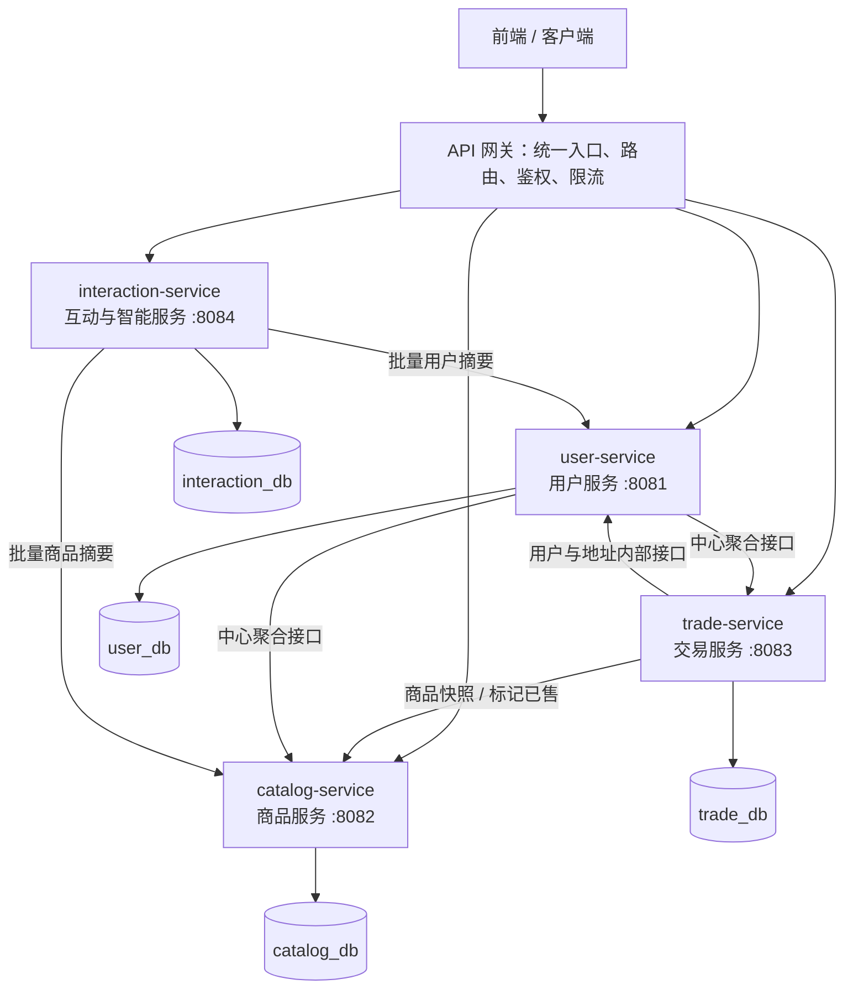

# 后端微服务拆分设计

本文按《第三组微服务划分.pdf》固化目标架构、接口归属、20 张业务表归属和跨服务失败策略。

## 1. 前后版本

- 改造前：提交 `4599e1d`，标签 `microservices-before`，单个 `shopping_back` 应用直接访问 `shop_db`。
- 改造后：包含本文的提交，标签 `microservices-after`。`services/` 中有 4 个可独立构建、测试和部署的业务服务。
- 迁移方式：保留旧单体承接未迁 API，新接口逐项切到微服务；禁止新旧服务同时写同一张表。

API 网关、注册中心、配置中心、前端和 MySQL 实例属于基础设施，不计入业务服务数量。

## 2. 服务划分图



| 服务 | 主要职责 | 划分理由 |
|---|---|---|
| 用户服务 `user-service` | 注册登录、身份认证、个人资料、实名认证、信用、收货地址、用户管理 | 都围绕用户身份和生命周期，安全要求与数据一致性相近 |
| 商品服务 `catalog-service` | 商品、店铺、收藏、浏览记录、关注店铺、商品审核、图片上传 | 商品和店铺是平台核心目录，查询量大，适合作为独立扩容单元 |
| 交易服务 `trade-service` | 购物车、下单、订单状态、取消订单、评价 | 交易边界明确，后续可单独做订单压力测试和扩容 |
| 互动与智能服务 `interaction-service` | 话题、帖子、评论、点赞、关注话题、帖子行为、会话、消息、已读、AI、WebSocket | 社区互动、即时会话和智能能力都属于用户互动域，与交易核心流程耦合较低 |

## 3. 服务接口清单

外部 API 路径保持旧前端契约不变，API 网关按归属转发；内部接口统一使用 `/internal/**` 且不暴露到公网。

### 用户服务

- 认证：`POST /api/auth/register`、`POST /api/auth/login`、`GET /api/auth/me`、`PUT /api/auth/me/profile`、`GET /api/auth/search-users`。
- 用户中心：`GET /api/center/buyer|seller|admin`，买家/卖家实名认证提交与取消，管理员用户状态、信用、删除用户以及实名审核接口。
- 地址：`GET|POST /api/address`、`PUT|DELETE /api/address/{addressId}`、`PUT /api/address/{addressId}/default`。
- 内部：`GET /internal/users/{userId}`、`POST /internal/users/batch`、`GET /internal/users/{userId}/addresses/{addressId}`、`POST /internal/users/{userId}/credit-records`。

### 商品服务

- 商品：`GET /api/products`、`GET /api/products/mine`、`GET /api/products/{id}`、`POST /api/products`、`PUT /api/products/{id}`。
- 店铺：`GET /api/stores`、`GET /api/stores/mine`、`PUT /api/stores/mine`、`GET /api/stores/{id}`、`GET /api/stores/{id}/products`、关注/取消关注店铺。
- 用户商品关系：收藏、足迹、关注店铺对应的 `/api/center/buyer/items/favorite|history|follow` 接口。
- 审核与上传：`GET /api/admin/audit`、`POST /api/admin/audit/{id}`、`POST /api/upload/image`。
- 内部：`GET /internal/products/{goodsId}/snapshot`、`POST /internal/products/batch`、`PUT /internal/products/{goodsId}/sold`、`GET /internal/stores/{storeId}/summary`。

### 交易服务

- 购物车：`GET|POST /api/cart`、`PUT|DELETE /api/cart/{cartId}`、`PUT /api/cart/{cartId}/select`。
- 订单：`GET|POST /api/orders`、`POST /api/orders/{id}/cancel`、`POST /api/orders/{id}/review`。
- 内部：`GET /internal/orders/{orderId}`、`GET /internal/orders/{orderId}/participants`、`GET /internal/sellers/{sellerId}/summary`。

### 互动与智能服务

- 社区：话题列表/详情/创建/关注，帖子列表/创建，评论、点赞、收藏与分享接口。
- 聊天：会话列表/创建，消息查询/发送，转人工、AI 议价、已读、状态修改和删除会话。
- AI：`POST /api/ai/assistant`、`POST /api/ai/assist`、`POST /api/ai/publish-suggestion`。
- 实时通信：`WebSocket /ws/**`。

当前迁移切片已实现下单链路所需的内部用户/地址、商品快照、标记已售接口，以及四个服务各自的代表性外部接口。其余旧接口仍在单体中运行，后续按上表逐项搬迁，不能改变归属。

## 4. 20 张业务表归属

| 数据库 | 服务 | 表 |
|---|---|---|
| `user_db` | 用户服务 | `users`、`user_realname_auth`、`credit_record`、`user_address` |
| `catalog_db` | 商品服务 | `goods`、`store`、`favorite_goods`、`browse_history`、`follow_store` |
| `trade_db` | 交易服务 | `cart_item`、`orders`、`product_review` |
| `interaction_db` | 互动与智能服务 | `community_topic`、`topic_post`、`topic_comment`、`topic_post_like`、`topic_post_action`、`follow_topic`、`conversation`、`chat_message` |

数据访问约束：

1. 每张表只能由所属服务直接读写。
2. 四个数据库可以共用一个 MySQL 实例，但生产环境使用不同数据库账号和最小权限。
3. 服务之间只保存逻辑业务 ID，不建立跨数据库外键，不执行跨库 JOIN。
4. 跨服务数据通过 REST、事件或消息访问。
5. 订单保存商品名、成交价等快照，商品后续修改不影响历史订单。

## 5. 跨服务调用与失败处理

### 创建订单

1. 交易服务用用户服务校验用户状态和收货地址归属。
2. 交易服务调用商品快照接口，校验商品存在、审核通过且可售。
3. 交易服务以唯一 `clientRequestId` 幂等写入订单和商品快照。
4. 交易服务调用商品服务幂等标记已售；成功后订单变为 `CONFIRMED`。
5. 用户/商品服务在连接 500 ms、读取 1000 ms 内不可用时返回 503。校验失败时不写订单；标记已售失败时订单进入 `COMPENSATION_REQUIRED`，相同业务号重试，3 次仍失败则转为 `CANCELLED`。

### AI 议价

互动与智能服务调用商品服务读取状态、当前价格和最低价。调用设置超时并优先使用短期缓存；商品服务不可用且无缓存时返回“商品信息暂时不可用，请稍后重试”。AI 模型不可用时使用规则生成备用建议，普通聊天仍可用。

### 买家中心和卖家中心

用户服务并行聚合自身数据、商品服务的收藏/足迹/店铺/发布统计以及交易服务的订单/待处理/销售额。部分下游不可用时仍返回用户基本信息，并设置 `partial=true` 与 `unavailableModules`，不让一个依赖故障拖垮整个聚合接口。

### 社区内容展示

互动与智能服务通过批量接口查询作者公开信息和帖子关联商品摘要，并使用短期缓存。用户服务故障时显示匿名作者；商品服务故障时隐藏商品卡片，帖子正文仍展示。禁止列表页逐条远程调用。

### 熔断降级（Resilience4j）

跨服务 REST 调用在超时之上再包一层 Resilience4j 熔断器（`resilience4j-circuitbreaker` 核心库，直接包装客户端调用，不引入 AOP）。只有 5xx 响应和连接/读写超时计入失败统计，404/422 等业务错误不触发熔断。

- 交易服务：`HttpCatalogClient`（商品快照、标记已售）使用 `catalog` 熔断器，`HttpUserClient`（登录校验、用户/地址校验）使用 `user` 熔断器。熔断打开时快速失败，抛出 `503 SERVICE_UNAVAILABLE`（“商品/用户服务暂不可用，请稍后重试”），上层 `OrderService`/`CartService` 的既有 `catch` 与补偿逻辑（`COMPENSATION_REQUIRED` → 3 次后 `CANCELLED`）不受影响。
- 互动与智能服务：`CatalogClient`（帖子关联商品/店铺摘要）使用 `catalog` 熔断器，熔断打开时按原有降级语义返回 `null`，即隐藏商品/店铺卡片，帖子正文仍展示。

熔断参数写在各服务 `application.properties`（`app.circuit-breaker.*`，可用环境变量覆盖）：

| 参数 | 默认值 | 含义 |
|---|---|---|
| `sliding-window-size` | 10 | 基于计数的滑动窗口，统计最近 10 次调用 |
| `failure-rate-threshold` | 50 | 窗口内失败率 ≥50% 时熔断打开 |
| `wait-duration-in-open-state-ms` | 30000 | 熔断打开 30 秒后进入半开 |
| `permitted-calls-in-half-open-state` | 3 | 半开放行 3 次试探，成功则关闭熔断 |

## 6. 构建与测试

```powershell
# 四服务自动化测试，使用内存数据库
.\services\test-services.ps1

# 任一服务独立构建示例
.\shopping_back\shopping_back\mvnw.cmd -f .\services\trade-service\pom.xml clean package
```

四个目录均包含 Dockerfile。各服务可独立制作镜像、升级和回滚；根 Maven 聚合只为 CI 提供一次性构建入口，不构成运行时依赖。
