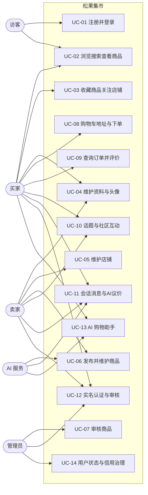
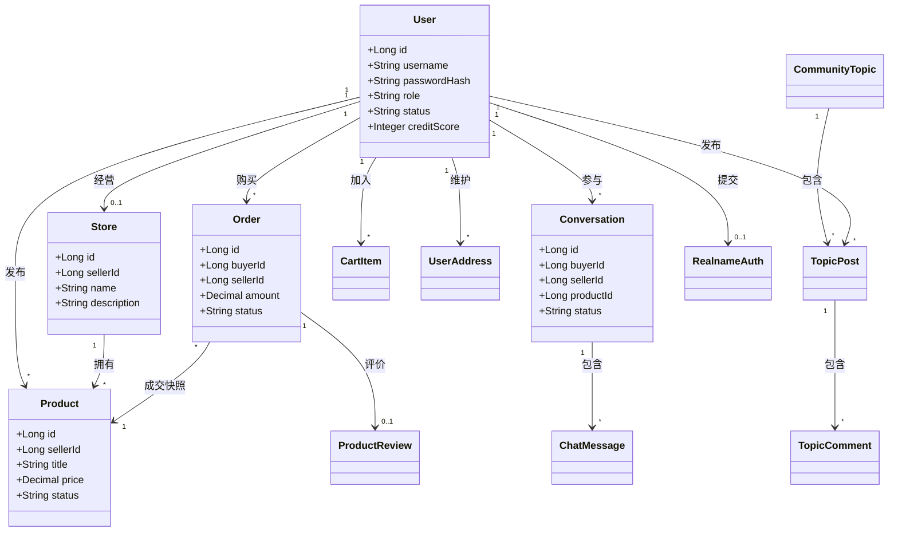

# 松果集市（校园新品与二手交易平台）软件需求规格说明书

| 文档属性 | 内容 |
|---|---|
| 系统名称 | 松果集市（校园新品与二手交易平台） |
| 系统标识 | TRADE-PLATFORM-2026 |
| 文档名称 | 软件需求规格说明书 |
| 文档编号 | TP-SRS-001 |
| 文档版本 | V2.2（仓库 Markdown 版） |
| 文档基线 | 当前主分支代码与配套文档 |
| 编制单位 | 软件工程基础第 3 组 |
| 文档状态 | 评审稿 |

> 本文档是桌面《需求说明书.pdf》（V2.2，2026-08-29 修订）的仓库内 Markdown 版本，章节结构与编号与 PDF 一致；与 PDF 的对应关系见文末「版本对应说明」。原仓库骨架版（一期目标、功能模块占位等）的有效信息已并入 §2.5、§6、§7，不再单独保留。

修订记录：

| 版本 | 日期 | 修订说明 |
|---|---|---|
| V1.0 | 2026 春 | 初版文档。 |
| V2.1 | 2026-08-28 | 同步当前代码：更新 Java 17、服务端购物车与地址、Kubernetes 部署及单元、接口和端到端测试基线。 |
| V2.2 | 2026-08-29 | 统一 UC-01～UC-14 用例口径，区分现有模型覆盖与缺口，并按已完成的历史测试结果整理证据状态。 |

## 1 引言

### 1.1 目的

本文档规定松果集市的功能、数据、接口、性能、安全、质量、运行和验收要求，是概要设计、详细设计、编码、测试、部署和课程验收的共同基线。目标读者包括指导教师、项目组成员、测试人员、部署人员和后续维护人员。

### 1.2 范围

松果集市面向高校师生及校园周边可信用户，支持新品与二手商品的浏览、搜索、发布、审核、交易、评价、社区交流、即时沟通和 AI 辅助。系统以 H5/浏览器为主要交付形态，并保留微信小程序适配能力。

系统范围内包括：

1. 用户注册、登录、资料维护、实名认证、角色与信用管理；
2. 商品和店铺的浏览、搜索、发布、维护、关注与审核；
3. 购物车、订单创建、模拟支付、收货和评价；
4. 话题、帖子、评论、点赞、想要和收藏；
5. 会话、消息、已读状态、WebSocket 同步和 AI 辅助议价；
6. 管理员对用户、实名和商品的治理；
7. 图片上传、统一响应、异常处理、日志和部署支撑。

系统范围外包括：真实资金清算、真实物流承运、线下商品质量担保、校园身份平台的正式对接，以及未经批准的第三方数据采集。课程版本中的"支付"为模拟支付，不产生真实扣款。

### 1.3 产品背景

校园闲置物品具有价格敏感、交易半径小、时效集中和信任成本高等特点。通用交易平台难以充分表达校园面交、学习资料、毕业季流转和学生信用等场景。松果集市通过商品信息结构化、实名与信用、审核治理、社区内容和即时沟通，形成从发现到成交再到评价的业务闭环。

### 1.4 引用与依据

1. 项目原《软件需求规格说明书》；
2. 《参考.docx》中的用例图、概念类图、组件图和顺序图示例；
3. GB/T 8567-2006《计算机软件文档编制规范》；
4. ISO/IEC/IEEE 29148 关于需求工程与软件需求规格的通用原则；
5. 当前仓库代码、数据库脚本、接口文档、测试文档及需求追溯表（`docs/追溯表.md`）。

## 2 产品整体描述

### 2.1 产品定位与目标

产品目标是建设一个安全、便捷、可演示、可部署、可扩展的校园交易平台：

- 提高校园闲置资源的重复利用率；
- 缩短买家从搜索到成交的操作路径；
- 为卖家提供发布、店铺、咨询和订单管理能力；
- 通过实名、信用和审核降低虚假信息与交易风险；
- 通过社区和 AI 辅助增强商品发现与议价体验；
- 保持需求、设计、实现、测试之间可追踪。

### 2.2 用户角色

| 角色 | 说明 | 核心权限 |
|---|---|---|
| 访客 | 未登录访问者 | 浏览公开商品、店铺和话题；进入登录或注册 |
| 买家 | 已登录普通用户 | 收藏、关注、加入购物车、下单、评价、发帖、聊天、提交实名 |
| 卖家 | 具备卖家角色的用户 | 买家能力，以及维护店铺、发布商品、处理咨询和查看相关订单 |
| 管理员 | 平台治理人员 | 审核商品与实名、管理用户状态与信用、查看治理数据 |
| AI 服务 | 外部或内置智能能力 | 提供问答、发布建议和议价建议；不得直接改变订单或审核结果 |

### 2.3 运行状态与降级方式

1. 访客状态：允许浏览公开内容，身份相关操作应引导登录。
2. 认证状态：登录用户依据角色和资源归属访问业务功能。
3. 卖家经营状态：卖家可维护本人店铺和商品，不得操作他人资源。
4. 管理员治理状态：高风险操作必须校验管理员角色并二次确认。
5. 高峰状态：毕业季、开学季等集中访问期间优先保证登录、浏览、下单和审核。
6. 降级状态：外部 AI 不可用时，核心交易流程必须继续；系统可返回规则建议或明确的降级提示。
7. 恢复状态：数据库、网络或服务异常后应保留错误日志，避免生成重复订单或重复互动记录。

### 2.4 总体业务流程

主流程为：注册/登录 → 完善资料与实名 → 浏览或发布商品 → 搜索筛选 → 沟通议价 → 加入购物车 → 确认订单与模拟支付 → 交付/收货 → 评价与信用更新。

辅助流程包括社区交流、店铺/话题关注、商品审核、实名审核、用户治理和 AI 辅助。

总体架构图、模块结构图见 PDF 版图 2-1、图 2-2；组件图见 §7 与《3组-UML模型汇总.pdf》§3.1。

### 2.5 运行环境

| 类别 | 要求 |
|---|---|
| 客户端 | Chrome、Edge、Firefox 等现代浏览器；H5 移动浏览器；可编译为微信小程序 |
| 前端 | uni-app（Vue3）；REST API；聊天场景可使用 SockJS/STOMP |
| 后端 | JDK 17、Spring Boot 3.5.x、MyBatis、WebSocket/STOMP |
| 数据库 | MySQL 8.x，字符集 utf8mb4 |
| 部署 | Windows 或 Linux；支持本地运行、Docker Compose 一键部署及 Kubernetes 清单部署 |
| 网络 | 校园网、局域网或互联网；生产环境应使用 HTTPS/WSS |
| 外部服务 | 可选 AI HTTP API；外部服务失效不得阻塞核心交易链路 |

### 2.6 假设与依赖

- 用户对自己提交的身份、商品和交易信息负责；
- 图片存储目录或对象存储可用且容量受控；
- MySQL 是业务数据的权威来源；
- 课程版本不接入真实支付和物流平台；
- AI 输出仅作为建议，用户应确认后再执行发布或议价操作；
- 当前 Token 为后端内存态实现，生产化前需替换为可撤销、可过期、可横向扩展的认证方案。

## 3 功能需求

### 3.1 总体用例模型

（与 PDF 版图 3-1「松果集市总体用例图」、图集 §1.2「社区用例图」对应。）

#### 3.1.1 统一业务用例清单

| 编号 | 业务用例 | 主要参与者 |
|---|---|---|
| UC-01 | 注册并登录 | 访客 |
| UC-02 | 浏览、搜索并查看商品 | 访客、用户 |
| UC-03 | 收藏商品、关注店铺并查看 | 买家 |
| UC-04 | 维护个人资料与头像 | 用户 |
| UC-05 | 卖家查看并维护店铺 | 卖家 |
| UC-06 | 卖家发布并维护商品 | 卖家 |
| UC-07 | 管理员审核商品 | 管理员 |
| UC-08 | 维护购物车和地址并创建订单 | 买家 |
| UC-09 | 查询订单并提交评价 | 买家 |
| UC-10 | 创建话题并完成社区互动 | 用户 |
| UC-11 | 建立会话、收发消息并使用 AI 议价 | 买家、卖家 |
| UC-12 | 提交实名认证并由管理员审核 | 买家、卖家、管理员 |
| UC-13 | 使用 AI 购物助手 | 用户 |
| UC-14 | 管理员维护用户状态与信用 | 管理员 |

### 3.2 功能需求总表

#### 3.2.1 用户与权限

| 编号 | 需求与验收条件 |
|---|---|
| FR-U01 | 用户应能以用户名、密码、手机号和买家/卖家角色注册；系统不得允许公开注册管理员；用户名重复或字段非法时拒绝。 |
| FR-U02 | 用户应能登录；正确凭据返回令牌和脱敏资料，错误密码返回未认证，禁用账户返回禁止访问。 |
| FR-U03 | 登录用户应能查询本人资料；缺失、无效或过期令牌不得返回资料。 |
| FR-U04 | 登录用户应能修改允许的资料字段；不得通过请求修改用户 ID、角色、状态或信用等受控字段。 |
| FR-U05 | 买家或卖家应能提交和取消实名认证；状态至少包括待审核、通过、驳回和已取消；证件号仅保存/展示脱敏值。 |
| FR-U06 | 受保护接口必须校验登录、角色和资源归属；未登录返回 401，角色或归属不符返回 403。 |
| FR-U07 | 用户搜索只能返回业务必要的公开字段，不得泄露密码散列、完整手机号或证件信息。 |

#### 3.2.2 商品、店铺与发现

| 编号 | 需求与验收条件 |
|---|---|
| FR-P01 | 卖家应能填写标题、分类、成色、价格、描述、交易地点和图片发布商品；必填字段、长度和金额边界必须校验。 |
| FR-P02 | 用户应能分页浏览商品；列表至少展示标题、价格、成色、场景、封面和卖家/店铺信息。 |
| FR-P03 | 用户应能查看商品详情；不存在或不可见商品返回 404 或等价错误，不得泄露内部审核数据。 |
| FR-P04 | 用户应能按关键词、场景和分类筛选商品；组合筛选结果必须满足全部条件。 |
| FR-P05 | 用户应能查看店铺列表、店铺详情及其商品；卖家只能修改本人店铺。 |
| FR-P06 | 登录用户应能关注/取消关注店铺；重复关注不得产生重复记录，状态应可回显。 |

商品状态图、商品发布活动图、商品发现与收藏活动图分别见 PDF 版图 3-2、图 3-3、图 3-3A（UML 图集 §5.1、§6.1）。

#### 3.2.3 交易与评价

| 编号 | 需求与验收条件 |
|---|---|
| FR-T01 | 登录用户应能加入、勾选、改量和移除购物车商品；购物车通过服务端接口写入 MySQL，刷新或更换设备后仍可按同一账号读取。 |
| FR-T01A | 登录用户应能新增、修改、删除和设为默认收货地址；只能操作本人地址，首个地址自动成为默认地址。 |
| FR-T02 | 买家应能基于非空商品项创建订单；不得购买本人商品；不存在、不可售或价格已变化时应中止并提示。 |
| FR-T03 | 买家只能查看本人订单；卖家只能查看与本人相关的订单；管理员访问应有授权和审计。 |
| FR-T04 | 模拟支付应具有明确成功/失败结果；重复提交不得生成重复订单；失败时不得清空购物车。 |
| FR-T05 | 买家应能对待收货订单确认收货；合法状态迁移到已完成，重复确认不产生副作用。 |
| FR-T06 | 已完成订单的买家应能提交 1～5 分商品/卖家评分和非空评价；同一订单只能评价一次。 |

目标订单状态图、交易结算活动图见 PDF 版图 3-4、图 3-5（UML 图集 §5.2、§6.2）。

#### 3.2.4 社区与话题

| 编号 | 需求与验收条件 |
|---|---|
| FR-C01 | 用户应能按关键词或分类浏览话题，并查看话题详情。 |
| FR-C02 | 登录用户应能创建标题、类型、描述完整的话题；空值和超长输入应拒绝。 |
| FR-C03 | 用户应能查看话题下帖子；登录用户可发布非空帖子并关联可选商品或店铺。 |
| FR-C04 | 登录用户应能对存在的帖子发表评论；空评论、无效帖子或未登录请求应拒绝。 |
| FR-C05 | 登录用户应能切换点赞、想要和收藏；相同动作重复提交应表现为幂等切换，非法动作类型应拒绝。 |

#### 3.2.5 聊天与 AI

| 编号 | 需求与验收条件 |
|---|---|
| FR-A01 | 买卖双方应能围绕商品创建、查询、转人工、关闭和删除本人参与的会话。 |
| FR-A02 | 会话参与方应能查看、发送消息并更新已读状态；非参与方不得访问。 |
| FR-A03 | 在线消息应通过 WebSocket/STOMP 同步；断线后仍可用 REST 查询补齐消息。 |
| FR-A04 | 用户可请求 AI 议价建议；建议应结合商品价、底价或上下文，且不能自动提交订单或修改商品价格。 |
| FR-A05 | 系统可提供发布建议和智能问答；空输入应拒绝，模型超时或异常时应降级并给出可理解提示。 |

聊天与 AI 议价活动图见 PDF 版图 3-6（UML 图集 §6.3）。

#### 3.2.6 平台治理

| 编号 | 需求与验收条件 |
|---|---|
| FR-G01 | 管理员应能查看待审商品并批准或驳回；驳回需记录原因；非管理员不得操作。 |
| FR-G02 | 用户应能举报商品、用户或社区内容；管理员应能查询、处理并保留结果。 |
| FR-G03 | 管理员应能启用或禁用用户；禁用应在下一次认证请求生效，且保留操作者、时间和原因。 |
| FR-G04 | 管理员应能批准或驳回实名申请；驳回原因可回显，证件信息始终脱敏。 |
| FR-G05 | 管理员应能调整信用分并记录原因；评价触发的信用更新与人工调整不得相互覆盖。 |

### 3.3 用例规约

以下给出全部 14 个用例的用例说明。UC-01、UC-06、UC-08、UC-10、UC-11 与 UC-07/12/14 的详细规约与 PDF 版 §3.3 一致；其余用例按同一格式补齐。

#### 3.3.1 UC-01 注册并登录

| 项目 | 描述 |
|---|---|
| 主要参与者 | 访客 |
| 触发条件 | 访客提交用户名和密码 |
| 前置条件 | 用户已注册；服务和数据库可用 |
| 后置条件 | 成功时生成登录令牌并返回脱敏用户信息；失败时不建立登录态 |
| 主成功流程 | 1. 用户输入凭据；2. 系统校验格式；3. 查询用户；4. 校验账户状态；5. 验证 BCrypt 密码；6. 生成令牌；7. 返回角色首页所需资料 |
| 备选/异常流程 | A1 用户不存在或密码错误：返回统一认证失败信息；A2 用户被禁用：返回 403；A3 参数缺失：返回 400；A4 服务异常：记录日志并返回统一错误 |
| 可验证结果 | 正确凭据返回令牌与脱敏资料；错误凭据不返回令牌；禁用账户返回 403；密码不明文保存或输出 |
| 特殊需求 | 密码不得明文保存或输出；错误信息不得帮助枚举用户名；平均响应时间不超过 1 秒 |

对应顺序图：PDF 版图 3-7 / UML 图集 §4.1 用户登录时序图。

#### 3.3.2 UC-02 浏览、搜索并查看商品

| 项目 | 描述 |
|---|---|
| 主要参与者 | 访客、用户 |
| 触发条件 | 用户打开首页/逛逛页，或输入关键词、选择场景/分类筛选 |
| 前置条件 | 存在已上架商品；浏览公开内容无需登录 |
| 后置条件 | 返回满足全部筛选条件的分页商品列表或商品详情；不产生任何写操作 |
| 主成功流程 | 1. 用户浏览分页列表；2. 输入关键词或选择场景/分类；3. 系统组合筛选并返回结果；4. 用户点击进入商品详情；5. 系统返回详情与卖家/店铺信息 |
| 备选/异常流程 | A1 无匹配结果：返回空列表而非错误；A2 商品不存在或不可见：返回 404，不泄露审核数据；A3 非法分页/筛选参数：返回 400 |
| 可验证结果 | 组合筛选结果满足全部条件；不存在商品返回 404；列表包含标题、价格、成色、场景、封面等字段 |

#### 3.3.3 UC-03 收藏商品、关注店铺并查看

| 项目 | 描述 |
|---|---|
| 主要参与者 | 买家 |
| 触发条件 | 买家在商品详情或店铺页点击收藏/关注 |
| 前置条件 | 买家已登录；目标商品或店铺存在 |
| 后置条件 | 产生一条收藏或关注记录并更新计数；重复操作不新增记录；用户中心可查看列表 |
| 主成功流程 | 1. 买家点击收藏商品或关注店铺；2. 系统校验登录与目标存在性；3. 写入收藏/关注记录；4. 买家在用户中心查看收藏与关注列表 |
| 备选/异常流程 | A1 重复收藏/关注：表现为幂等切换，不产生重复记录；A2 未登录：返回 401 并引导登录；A3 目标不存在：返回 404 |
| 可验证结果 | 数据库中同一用户对同一目标至多一条记录；状态可回显；取消后列表不再展示 |

对应活动图：PDF 版图 3-3A 商品发现与收藏活动图。

#### 3.3.4 UC-04 维护个人资料与头像

| 项目 | 描述 |
|---|---|
| 主要参与者 | 用户（买家、卖家） |
| 触发条件 | 用户在个人中心修改资料或头像 |
| 前置条件 | 用户已登录且令牌有效 |
| 后置条件 | 允许修改的字段被更新；受控字段（用户 ID、角色、状态、信用）保持不变 |
| 主成功流程 | 1. 用户进入个人中心；2. 系统返回脱敏的本人资料；3. 用户修改昵称、头像等字段并提交；4. 系统校验字段格式与令牌；5. 保存并返回更新后资料 |
| 备选/异常流程 | A1 令牌缺失/伪造/过期：返回 401；A2 头像地址非法（系统路径、非法格式、超长）：拒绝；A3 试图修改受控字段：忽略或拒绝 |
| 可验证结果 | 合法修改生效并可回显；受控字段不可通过请求改变；头像地址仅接受合法 URL 或可访问资源标识 |

#### 3.3.5 UC-05 卖家查看并维护店铺

| 项目 | 描述 |
|---|---|
| 主要参与者 | 卖家 |
| 触发条件 | 卖家进入卖家中心或店铺管理页 |
| 前置条件 | 卖家已登录且具备卖家角色；店铺记录存在 |
| 后置条件 | 店铺信息被合法更新；任何用户可查看店铺详情与其商品列表 |
| 主成功流程 | 1. 卖家查看本人店铺及经营数据；2. 修改店铺名称、简介等信息；3. 系统校验归属与字段；4. 保存并返回最新店铺信息；5. 访客可查看店铺详情与店内商品 |
| 备选/异常流程 | A1 修改他人店铺：返回 403；A2 未登录：返回 401；A3 店铺不存在：返回 404 |
| 可验证结果 | 卖家只能修改本人店铺；店铺详情展示其商品列表；越权修改被拒绝 |

#### 3.3.6 UC-06 卖家发布并维护商品

| 项目 | 描述 |
|---|---|
| 主要参与者 | 卖家 |
| 触发条件 | 卖家在发布页提交商品信息 |
| 前置条件 | 已登录且具备卖家权限；上传服务可用 |
| 后置条件 | 生成商品记录并进入待审或已发布状态；失败时不生成不完整商品 |
| 主成功流程 | 1. 卖家进入发布页；2. 填写商品信息；3. 上传图片；4. 可请求 AI 发布建议并人工修改；5. 提交；6. 系统校验字段、价格和资源归属；7. 保存商品；8. 返回状态 |
| 备选/异常流程 | A1 图片失败：允许重试且不提交残缺记录；A2 必填项或金额非法：定位提示；A3 AI 不可用：跳过建议继续编辑；A4 无卖家权限：拒绝访问 |
| 可验证结果 | 合法商品入库并进入待审；非法字段/负价格/越权发布被拒绝；AI 内容须经用户确认后才提交 |
| 特殊需求 | AI 内容必须由用户确认；上传类型、大小和路径必须校验；同一次提交应避免重复记录 |

对应模型：商品发布顺序图（图集 §4.2）、商品发布活动图（图 3-3）、商品状态图（图 3-2）。

#### 3.3.7 UC-07 管理员审核商品

| 项目 | 描述 |
|---|---|
| 主要参与者 | 管理员 |
| 触发条件 | 存在待审商品，管理员进入审核中心 |
| 前置条件 | 管理员已登录并通过角色校验；存在待审核商品 |
| 后置条件 | 商品状态被合法更新为通过（上架）或驳回；驳回记录原因；操作可追踪 |
| 主成功流程 | 1. 管理员查看待审商品列表；2. 查看商品详情；3. 选择通过或驳回（驳回填写原因）并二次确认；4. 系统校验当前状态；5. 写入结果、原因和时间；6. 商品从前台可见性随状态切换 |
| 备选/异常流程 | A1 非管理员：403；A2 记录已被他人处理：返回冲突并刷新；A3 驳回原因缺失：拒绝；A4 数据库失败：回滚，不产生半完成状态 |
| 可验证结果 | 审核通过后商品可在前台展示；驳回商品不可见且原因可查；状态迁移符合商品状态图 |

#### 3.3.8 UC-08 维护购物车和地址并创建订单

| 项目 | 描述 |
|---|---|
| 主要参与者 | 买家 |
| 触发条件 | 买家在购物车勾选商品并点击结算 |
| 前置条件 | 已登录；购物车中至少一个已勾选、可售且非本人发布的商品；已选择地址 |
| 后置条件 | 成功时创建订单并清理相应购物车项；失败时购物车保持不变 |
| 主成功流程 | 1. 买家确认商品、地址和金额；2. 系统重新校验商品状态、归属和价格；3. 创建订单快照；4. 执行模拟支付；5. 记录结果；6. 成功后清理已选项并展示订单 |
| 备选/异常流程 | A1 商品下架/价格变化：提示刷新；A2 购买本人商品：拒绝；A3 重复点击：返回同一结果或拒绝重复请求；A4 支付失败：订单保持可重试/失败状态且不清购物车 |
| 可验证结果 | 订单金额由后端计算；重复提交不产生重复订单；购物车项按账号跨端可读；地址仅本人可操作，首个地址自动默认 |
| 特殊需求 | 订单创建和支付必须具有幂等策略；金额由后端计算；状态迁移必须符合图 3-4 |

对应模型：订单创建顺序图（图集 §4.3）、交易结算活动图（图 3-5）、订单状态图（图 3-4）。

#### 3.3.9 UC-09 查询订单并提交评价

| 项目 | 描述 |
|---|---|
| 主要参与者 | 买家 |
| 触发条件 | 买家进入订单列表，或对已完成订单点击评价 |
| 前置条件 | 买家已登录且存在本人订单；评价要求订单已完成 |
| 后置条件 | 返回订单列表/详情；评价成功写入评分与非空内容，并触发信用更新 |
| 主成功流程 | 1. 买家查询本人订单列表；2. 查看订单详情；3. 对待收货订单确认收货；4. 订单迁移到已完成；5. 买家提交 1～5 分评分和非空评价；6. 系统保存评价并更新信用记录 |
| 备选/异常流程 | A1 查询他人订单：拒绝，仅返回本人数据；A2 重复确认收货：无副作用；A3 同一订单重复评价：拒绝；A4 空评价或评分越界：返回 400 |
| 可验证结果 | 买家只能看到本人订单；同一订单至多一条评价；评价触发的信用更新与人工调整互不覆盖 |

#### 3.3.10 UC-10 创建话题并完成社区互动

| 项目 | 描述 |
|---|---|
| 主要参与者 | 访客、买家、卖家、管理员 |
| 触发条件 | 用户浏览话题或登录用户发布/互动 |
| 前置条件 | 浏览公开内容无需登录；发布与互动需要登录 |
| 后置条件 | 合法内容或互动记录可查询；切换类动作不产生重复记录 |
| 主成功流程 | 1. 浏览话题和帖子；2. 查看详情；3. 登录用户发布帖子或评论；4. 用户点赞/想要/收藏；5. 系统更新计数并返回当前状态 |
| 备选/异常流程 | A1 内容为空或超长：拒绝；A2 目标不存在：返回 404；A3 非法动作：返回 400；A4 管理员发现违规：隐藏内容并记录处理结果 |
| 可验证结果 | 同一用户同一动作幂等切换；话题/帖子/评论层级正确关联；未登录写操作返回 401 |

对应模型：社区用例图（图集 §1.2）、社区发帖顺序图（图集 §4.5）。

#### 3.3.11 UC-11 建立会话、收发消息并使用 AI 议价

| 项目 | 描述 |
|---|---|
| 主要参与者 | 买家、卖家、AI 服务 |
| 触发条件 | 买家在商品页发起咨询，或会话中任一方请求 AI 议价 |
| 前置条件 | 用户已登录且是会话参与方；商品存在 |
| 后置条件 | 消息持久化并可查询；AI 建议作为消息或建议展示；转人工后保留上下文 |
| 主成功流程 | 1. 买家发起咨询；2. 系统创建或复用会话；3. 双方发送消息；4. 消息经 REST 保存并通过 WebSocket 推送；5. 用户请求 AI 议价；6. 系统返回建议；7. 用户决定继续沟通或转人工 |
| 备选/异常流程 | A1 WebSocket 断开：使用 REST 保存并在重连后补齐；A2 AI 超时：提示降级，人工聊天继续；A3 非参与方访问：拒绝；A4 会话已关闭：禁止新增消息或明确恢复规则 |
| 可验证结果 | AI 建议不自动提交订单或修改商品价格；非参与方不得访问会话；消息顺序以服务端时间和主键为准 |
| 特殊需求 | 外部模型不得获取不必要的个人信息 |

对应模型：聊天与 AI 议价顺序图（图集 §4.4）、聊天议价活动图（图 3-6）。

#### 3.3.12 UC-12 提交实名认证并由管理员审核

| 项目 | 描述 |
|---|---|
| 主要参与者 | 买家、卖家、管理员 |
| 触发条件 | 用户提交实名认证申请 |
| 前置条件 | 用户已登录；管理员已登录并通过角色校验（审核环节） |
| 后置条件 | 实名状态在待审核、通过、驳回、已取消之间合法迁移；证件信息始终脱敏 |
| 主成功流程 | 1. 用户填写并提交实名信息（证件号脱敏保存）；2. 状态置为待审核；3. 管理员在治理中心查看待审记录；4. 执行批准或驳回并填写原因；5. 审核结果与原因同步写入用户实名状态 |
| 备选/异常流程 | A1 用户取消申请：状态迁移为已取消；A2 非管理员审核：403；A3 驳回原因缺失：拒绝；A4 重复提交：按当前状态返回冲突或覆盖规则 |
| 可验证结果 | 任何接口不返回完整证件号；驳回原因可回显；状态迁移合法可追踪 |

对应模型：实名认证审核顺序图（图集 §4.6）。

#### 3.3.13 UC-13 使用 AI 购物助手

| 项目 | 描述 |
|---|---|
| 主要参与者 | 用户、AI 服务 |
| 触发条件 | 用户在 AI 助手页输入问题 |
| 前置条件 | 用户已登录；AI 服务可用（不可用时进入降级） |
| 后置条件 | 返回问答建议；不产生订单、审核等业务状态变更 |
| 主成功流程 | 1. 用户输入自然语言问题；2. 系统校验非空并调用 AI 服务；3. 返回回答建议；4. 用户自行决定是否采纳 |
| 备选/异常流程 | A1 空输入：拒绝；A2 模型超时或异常：降级并给出可理解提示；A3 AI 不可用：核心交易流程不受影响 |
| 可验证结果 | 空输入返回 400；AI 目标响应不超过 5 秒，超时主动降级；AI 输出经安全过滤后展示 |

#### 3.3.14 UC-14 管理员维护用户状态与信用

| 项目 | 描述 |
|---|---|
| 主要参与者 | 管理员 |
| 触发条件 | 管理员在用户治理页执行禁用/启用、信用调整或处理举报 |
| 前置条件 | 管理员已登录并通过角色校验；目标用户存在 |
| 后置条件 | 用户状态或信用分被合法更新；操作者、时间和原因留痕；禁用在下一次认证请求生效 |
| 主成功流程 | 1. 管理员查看用户列表或待处理举报；2. 查看必要详情；3. 选择禁用/启用、信用调整或举报处理并二次确认；4. 系统校验当前状态；5. 写入结果、原因和时间；6. 返回更新后的状态 |
| 备选/异常流程 | A1 非管理员：403；A2 记录已被他人处理：返回冲突并刷新；A3 原因缺失：拒绝；A4 数据库失败：回滚 |
| 可验证结果 | 被禁用用户登录返回 403；信用调整形成审计记录且不与评价触发的更新相互覆盖；举报处理结果可查询 |

## 4 外部接口需求

### 4.1 用户界面

系统应提供首页/发现、商品详情、搜索结果、购物车、订单确认与列表、消息/聊天、AI 助手、发布、店铺、话题详情、用户中心、卖家中心和管理员审核等页面（前端实现见 `shopping_front/pages/`）。

界面要求：

- 页面标题、导航和返回行为保持一致；
- 表单明确标识必填项并就地提示错误；
- 删除、封禁、驳回、确认收货等操作必须二次确认；
- 加载、空数据、无权限、网络失败和重试状态必须可辨识；
- 桌面和常见移动宽度下不得出现关键控件遮挡或不可点击；
- 颜色不应成为状态表达的唯一方式。

### 4.2 软件接口

| 接口 | 约束 |
|---|---|
| 前后端 REST | 基础路径 /api；JSON 编码 UTF-8；统一返回 code、message、data |
| 认证 | Authorization: Bearer \<token\>；不得在 URL、日志或错误页输出令牌 |
| 数据库 | JDBC/MyBatis 访问 MySQL；涉及多表一致性的写操作应使用事务 |
| 文件上传 | POST /api/upload/image；校验 MIME、扩展名、大小和安全文件名；返回可访问资源标识 |
| WebSocket | 聊天使用 WebSocket/STOMP；应定义连接鉴权、订阅权限、重连与消息补偿 |
| AI 服务 | 通过标准 HTTP API 或 SDK；设置连接/读取超时；记录调用结果但不记录敏感正文 |

### 4.3 主要 REST 接口分组

| 分组 | 主要路径 | 说明 |
|---|---|---|
| 认证 | /api/auth/** | 注册、登录、本人资料、用户搜索 |
| 角色中心 | /api/center/** | 买家/卖家/管理员中心、实名、收藏足迹关注、用户治理 |
| 商品店铺 | /api/products/**、/api/stores/** | 列表、详情、发布、本人商品/店铺、关注 |
| 社区 | /api/topics/**、/api/topic-posts/** | 话题、帖子、评论、点赞和动作 |
| 订单评价 | /api/orders/** | 订单创建、列表和评价 |
| 购物车 | /api/cart/** | 列表、添加、改量、勾选和删除本人购物车项 |
| 收货地址 | /api/address/** | 列表、新增、修改、删除和设置本人默认地址 |
| 审核 | /api/admin/audit/** | 待审列表和审核决定 |
| 聊天 | /api/chat/** | 会话、消息、已读、转人工、状态、删除和 AI 议价 |
| AI | /api/ai/** | 问答和发布建议；后续应统一重复入口 |
| 上传 | /api/upload/image | 图片上传 |

### 4.4 通信与硬件接口

- 生产环境应使用 HTTPS 和 WSS，禁用不安全的跨域通配策略；
- 客户端通过普通 PC、笔记本或智能手机访问，不依赖专用硬件；
- 后端最低演示配置建议为 2 核 CPU、4 GB 内存和 20 GB 可用空间；
- 网络中断时，提交类操作应给出明确结果，不得让用户误以为成功；
- 所有接口应使用明确 HTTP 状态码，业务错误同时通过统一响应体说明。

## 5 数据需求

### 5.1 核心数据对象

当前数据库基线包含：users、user_realname_auth、goods、store、favorite_goods、browse_history、follow_store、follow_topic、cart_item、user_address、orders、product_review、credit_record、conversation、chat_message、community_topic、topic_post、topic_comment、topic_post_like、topic_post_action。

关键约束包括：

- 用户名应唯一，密码只保存 BCrypt 散列；
- 店铺关注、话题关注、帖子点赞和同类型帖子动作应具有组合唯一约束；
- 同一订单只能产生一条商品评价；
- 同一用户与商品在购物车中具有唯一组合，购物车项和地址操作必须校验用户归属；
- 商品金额使用定点小数，禁止使用浮点数存储；
- 会话消息按会话 ID 与创建时间建立查询索引；
- 图片字段保存资源地址或资源标识，不应保存任意本地绝对路径；
- 目标版本应补充明确外键或通过服务层保证引用完整性。

### 5.2 概念模型

（与 PDF 版 §5.2 概念模型及图 5-1 用户/店铺/关注关系图、图 5-2 交易核心 ER 图、图 5-3 社区与聊天关系图对应；UML 图集 §2.1～2.3。）

### 5.3 数据状态与一致性

- 商品状态必须遵循图 3-2；审核通过前的商品不得按公开商品展示；
- 订单状态必须遵循图 3-4，不得从已取消或已退款状态回到交易中状态；
- 创建订单、写入评价与更新信用等跨表操作应处于事务中；
- 删除会话时应先处理其消息，避免孤儿记录；
- 评价、关注、点赞和创建订单应具备重复请求保护；
- 订单必须保留成交时的商品名称、价格、卖家和地址等快照；当前表结构尚不完整，列为 P0 数据改进项。

### 5.4 数据保护与保留

- 密码、令牌、AI Key 和数据库凭据不得提交仓库或出现在日志；
- 手机号对非本人和非授权管理员应脱敏；证件号仅保留脱敏值；
- 用户资料、聊天消息和订单数据应按最小权限访问；
- 日志不应记录完整密码、令牌、证件号、手机号和 AI 密钥；
- 测试数据应与真实个人数据隔离；
- 删除账号前应明确订单、评价、消息和审计数据的保留/匿名化规则。

## 6 非功能需求

### 6.1 性能与容量

| 编号 | 指标 |
|---|---|
| NFR-P01 | 注册、登录、创建订单和审核列表接口，在标准测试环境下 P95 响应时间应不超过 1 秒。 |
| NFR-P02 | 用户资料查询 P95 应不超过 500 ms；商品列表与搜索 P95 应不超过 800 ms。 |
| NFR-P03 | 商品详情首屏在正常网络下应不超过 2 秒；图片应压缩、懒加载并限制体积。 |
| NFR-P04 | 聊天消息写入后 5 秒内应在在线参与方界面可见。 |
| NFR-P05 | AI 问答目标响应时间不超过 5 秒；超时后应主动降级，不阻塞交易操作。 |
| NFR-P06 | 演示基线应支持 20 个并发用户持续 60 秒的核心混合场景，接口错误率低于 1%。 |

性能结果必须以 JMeter 或等价工具的原始报告为证据，不得仅以主观体验判定。

### 6.2 安全

1. 密码必须使用 BCrypt 或同等级不可逆算法；
2. 鉴权应统一实施，并同时检查角色与资源归属；
3. 所有输入必须做长度、格式、枚举、金额和标识符校验；
4. 数据访问使用参数化 SQL，禁止拼接未信任输入；
5. 文件上传必须防止脚本文件、路径穿越、超大文件和同名覆盖；
6. 登录、禁用、信用调整、实名审核和商品审核应形成审计记录；
7. CORS 仅允许配置的来源；生产环境使用 HTTPS/WSS；
8. AI 提示词与响应不得包含无关个人数据，AI 输出在展示前应做安全过滤；
9. 高风险接口应具备限流、防重放或幂等控制；
10. 安全验收至少包括越权、SQL 注入、XSS、上传、弱口令、敏感信息泄露和跨域检查。

### 6.3 可靠性与可恢复性

- 数据库写入失败时事务应回滚并返回可诊断但不泄密的错误；
- 外部 AI、图片或 WebSocket 服务失败不得导致核心交易数据丢失；
- 服务重启后，数据库数据应保持；内存 Token 失效需给出重新登录提示；
- 关键配置从环境变量或本地私密配置读取；
- 应提供数据库备份与恢复步骤，并至少演练一次恢复；
- 删除、审核、信用调整等操作应避免重复执行和部分成功。

### 6.4 易用性与可访问性

- 新用户应能在无培训情况下完成注册、搜索、下单和发布主流程；
- 错误提示应说明原因和可执行的下一步；
- 关键页面应具有一致导航、清晰层级和可见反馈；
- 交互控件应有文字或可访问名称，键盘操作应覆盖主要 Web 流程；
- 图片应提供替代文本，表单输入应关联标签；
- 关键文本与背景应保持足够对比度。

### 6.5 可维护性、可测试性与可扩展性

- 前端页面通过 services 和统一 request 层访问后端，不在页面内散布地址和令牌逻辑；
- 后端保持 Controller、Service、Mapper 分层，统一异常和响应格式；
- 接口、DTO、数据库状态和前端调用变更时必须同步文档与测试；
- 核心业务应具备单元、接口和端到端测试；
- AI 能力应通过接口隔离，可替换模型或关闭而不改变核心交易契约；
- 推荐、缓存、对象存储和真实支付均应以可插拔方式扩展。

### 6.6 兼容性与可移植性

- H5 页面兼容当前主流 Chromium、Firefox 内核浏览器；
- 后端在 JDK 17 支持的 Windows/Linux 环境运行；
- MySQL 采用 utf8mb4，正确存储中文与表情字符；
- 不得在业务代码中硬编码仅适用于某台计算机的绝对路径；
- Docker 与本地启动方式应使用相同的接口和数据契约。

## 7 设计与实现约束

### 7.1 技术约束

- 采用前后端分离架构；前端为 uni-app/Vue，后端为 Spring Boot；
- 对外业务接口使用 REST/JSON；聊天实时通道使用 WebSocket/STOMP；
- 数据持久化使用 MySQL 与 MyBatis；
- 统一响应结构为 code、message、data；
- 密钥和密码通过环境变量或未纳入版本控制的本地配置提供；
- 单体版本（`shopping_back/`）为模块化单体，不为追求形式强行拆分微服务；微服务版本（`services/`：user-service 8081、catalog-service 8082、trade-service 8083、interaction-service 8084）按 `docs/microservices-split.md` 划分迁移。

### 7.2 部署约束

部署应区分前端发布与接入层、后端应用、MySQL、上传文件、配置、日志和外部 AI。Docker Compose（`deploy/docker-compose.yml`）负责单机一键部署；`k8s/` 中的 Kubernetes 清单与发布脚本用于集群部署。两种方式都必须为数据库和上传文件提供持久化，并通过反向代理统一暴露 HTTP/WebSocket 入口。

### 7.3 内部协作约束

- 页面不得绕过 service/request 层直接复制后端调用逻辑；
- Controller 不承担复杂业务规则，事务边界位于 Service；
- Mapper 只负责数据访问，禁止在 SQL 中隐式实现未经文档化的业务状态迁移；
- API、数据库脚本、需求追溯表、测试文档和用户手册必须随版本同步。

## 8 验收、追踪与未决事项

### 8.1 合格性方法

| 方法 | 适用内容 | 证据 |
|---|---|---|
| 检查 | 文档、页面、配置、数据库结构、日志与安全项 | 评审记录、检查表、扫描报告 |
| 分析 | 状态机、权限矩阵、数据一致性、容量与风险 | 设计评审、SQL/代码分析报告 |
| 演示 | 注册、浏览、发布、下单、社区、聊天、审核 | 演示脚本、截图或录像 |
| 测试 | 正常、边界、异常、鉴权、性能与安全需求 | JUnit、接口测试、E2E、JMeter、ZAP 报告 |

### 8.2 核心验收路径

1. 访客注册并登录，查询和修改个人资料；
2. 卖家维护店铺、上传图片、获取可选 AI 建议并发布商品；
3. 管理员查看待审商品并通过/驳回；
4. 买家搜索商品、查看详情、加入购物车并创建订单；
5. 买家模拟支付、确认收货并评价，信用结果可追踪；
6. 用户浏览话题、发帖、评论、点赞/想要/收藏；
7. 买卖双方创建会话、发送消息、断线恢复并请求 AI 议价；
8. 管理员审核实名、调整用户状态/信用并查看审计记录。

### 8.3 需求到测试的追踪规则

- 每个 FR-\* 和 NFR-\* 至少对应一个测试用例编号；
- 测试用例必须注明前置数据、步骤、期望结果和实际结果；
- 未通过需求不得标记"已验收"；
- 接口变更必须更新需求、接口文档、自动化测试和追溯矩阵；
- UML 图中的用例、组件和领域对象应使用与本文件一致的名称和编号；
- 逐用例的需求→模型→代码→测试映射见 `docs/追溯表.md`。

截至 2026-08-28，当前版本的验证基线如下（详细结果以 `docs/测试文档.md` 与 `docs/微服务接口测试与状态.md` 最新记录为准）：

| 测试层次 | 测试资产 | 当前结果 |
|---|---|---|
| 后端单元测试 | JUnit 5、Mockito | 单体 159 项通过；微服务 common 8、user 63，catalog/trade/interaction 均通过覆盖率门禁 |
| 接口回归测试 | Postman/Newman 集合 | 单体 196 断言通过；微服务 175 断言、0 失败 |
| 端到端测试 | Selenium，共 14 个场景（13 个测试类、15 项场景含冒烟） | 自动化场景通过；头像上传 1 项由人工/有头浏览器补测，自动化结果与人工结果分别归档 |
| 部署测试 | Docker Compose、远程部署检查、Kubernetes 清单检查 | 脚本和流水线配置已纳入主分支；部署结果以对应环境保存的日志和报告为准 |

### 8.4 优先级与当前差距

| 优先级 | 差距 | 完成判据 |
|---|---|---|
| P0 | 统一鉴权与资源归属检查 | 受保护接口稳定返回 401/403，并通过角色越权与对象越权测试 |
| P0 | 订单状态机、确认收货与支付幂等 | 覆盖待支付、待发货、待收货、完成、取消/退款的合法迁移与重复请求 |
| P0 | 举报与治理闭环 | 具备数据模型、用户提交、管理员查询/处理和审计记录 |
| P0 | 订单快照与事务一致性 | 订单保存成交信息；创建、评价和信用更新具备事务测试 |
| P1 | 购物车与地址接口回归 | 服务端存储已实现；补齐归属、重复添加、默认地址切换和跨端读取的自动化结果 |
| P1 | 认证生产化 | Token 可过期、撤销并支持多实例；日志不泄露令牌 |
| P1 | Newman 与 Selenium 自动化测试证据归档 | 已完成历史执行；需补齐 CodeArts 流水线号、提交号、Newman 报告和 Selenium 截图位置 |
| P2 | AI 接口统一与降级 | 统一问答契约；验证超时、限流、空响应和关闭模型场景 |

## 附录 A 术语与角色

| 术语 | 定义 |
|---|---|
| CSCI | 计算机软件配置项，本文指松果集市软件系统 |
| REST | 基于资源和 HTTP 方法的接口风格 |
| STOMP | 本项目聊天 WebSocket 通道使用的消息协议 |
| 幂等 | 同一请求重复执行一次或多次，业务最终结果保持一致 |
| 资源归属 | 当前用户是否拥有或参与其请求操作的商品、订单、店铺或会话 |
| 实名认证 | 用户提交脱敏身份信息并由管理员审核的过程 |
| 模拟支付 | 不连接真实资金渠道，只模拟支付结果和订单状态的课程功能 |
| AI 建议 | 模型输出的问答、标题、描述、定价或议价参考，不代表系统自动决策 |

## 版本对应说明

本文档与桌面 `C:\Users\win\Desktop\需求说明书.pdf`（TP-SRS-001，V2.2，2026-08-29）一一对应：

- 章节 1～8 及附录 A 的编号、标题与正文均按 PDF 版转写，未改变需求口径；
- PDF 中的图片（图 2-1～2-3、3-1～3-7、4-1、5-1～5-3、7-1）以文字引用代替，图名与《3组-UML模型汇总.pdf》中的对应图一致；
- PDF §3.3 仅给出 UC-01、UC-06、UC-08、UC-10、UC-11 与 UC-07/12/14 的详细规约，本文档 §3.3 按同一格式补齐了 UC-02、03、04、05、09、13、14 的用例说明（依据 §3.2 的 FR 条目归纳），其余规约与 PDF 一致；
- 图 3-1 总体用例图与 §5.2 概念模型在本文档中以 Mermaid 重绘，内容与 PDF 图片等价；
- 原仓库骨架版（25 行）中的一期目标、多端技术栈、非功能占位等内容已分别并入 §1.2、§2.5、§6 与 §7.1，未丢失有效信息。
